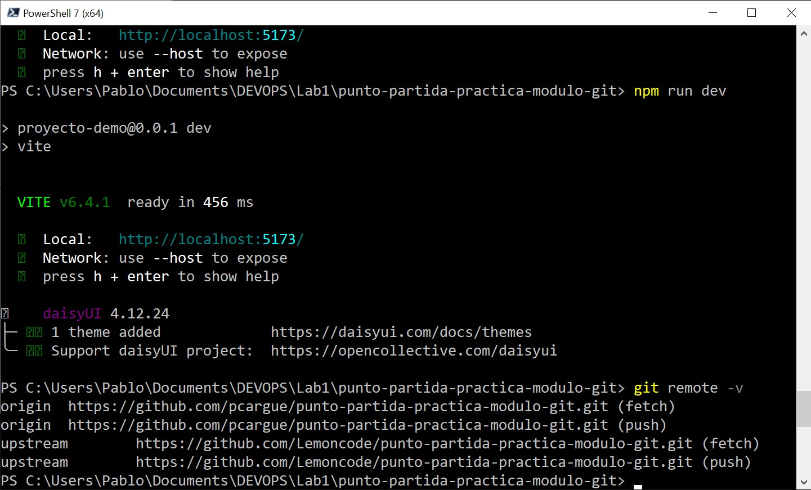
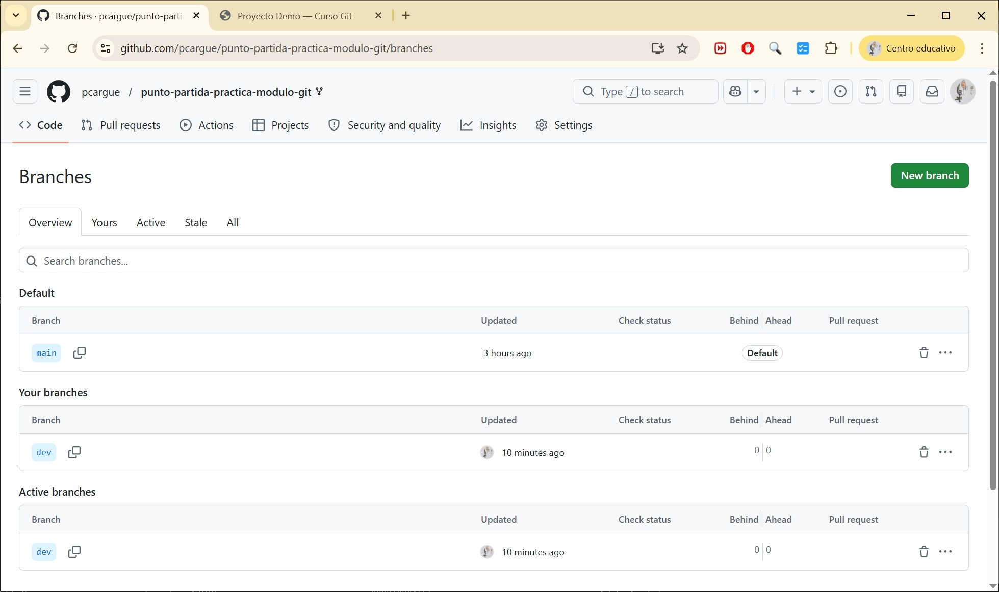
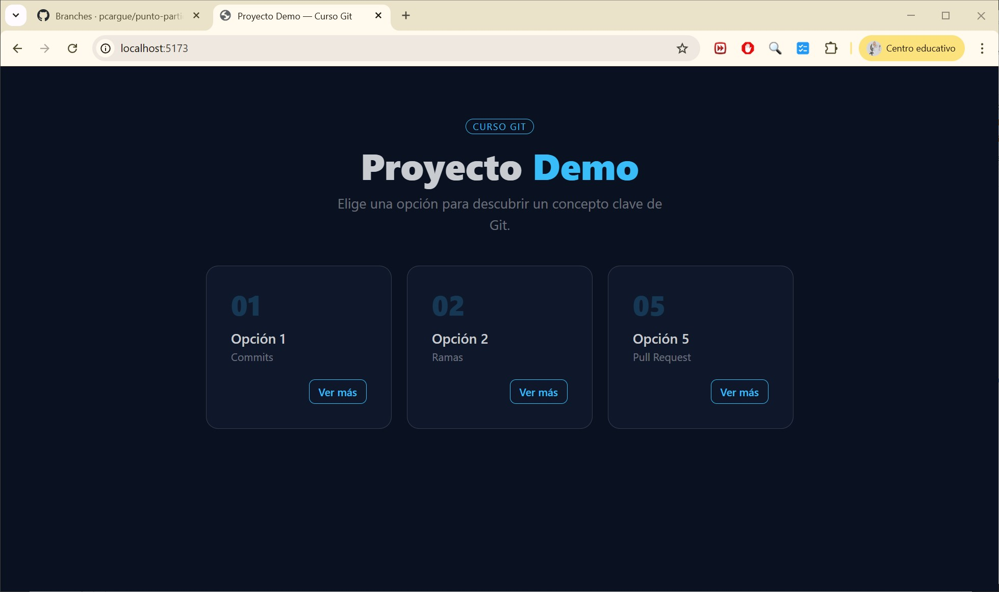
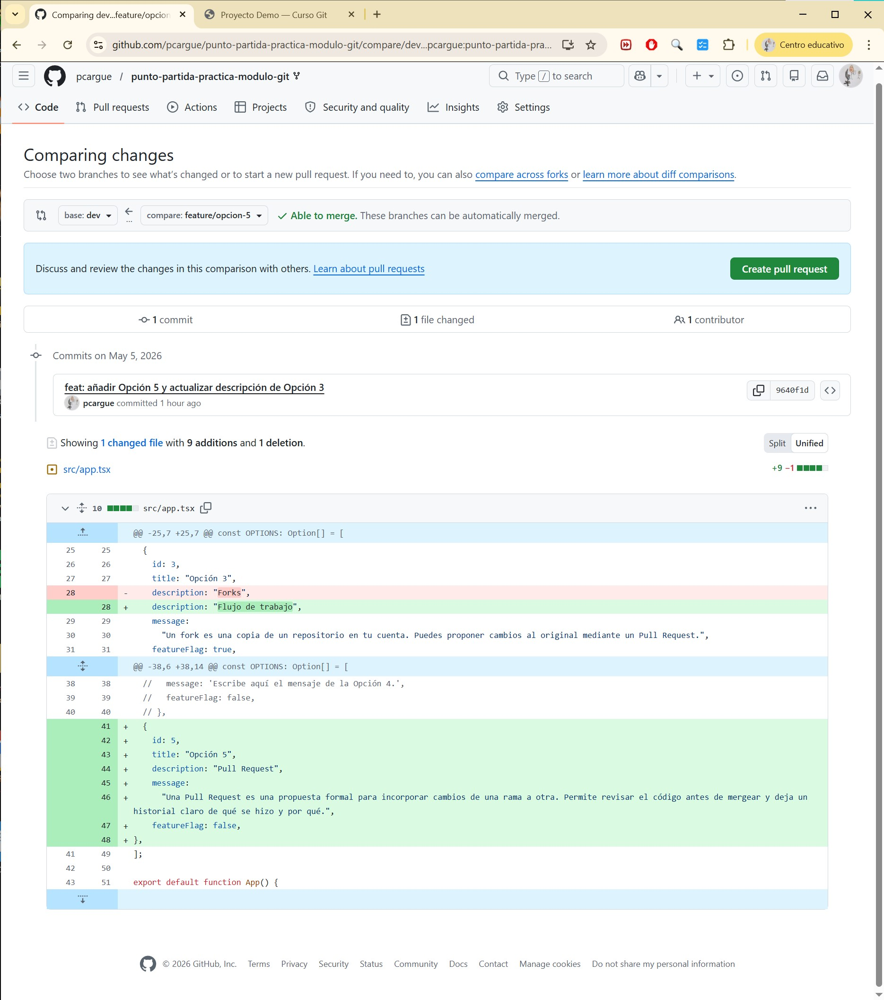
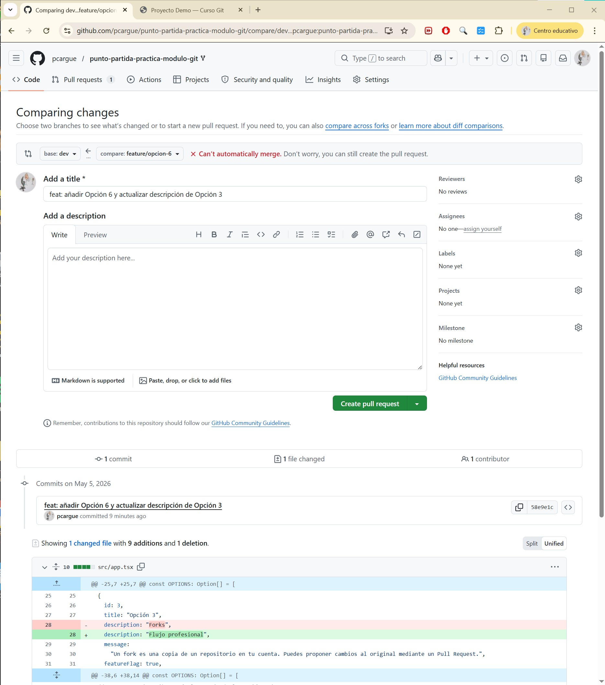
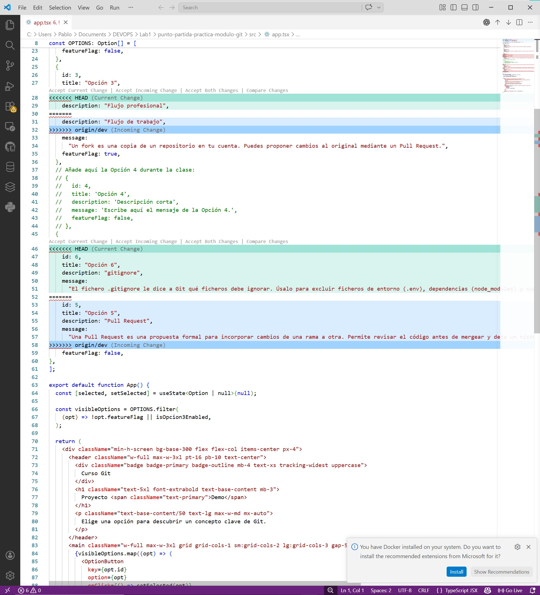
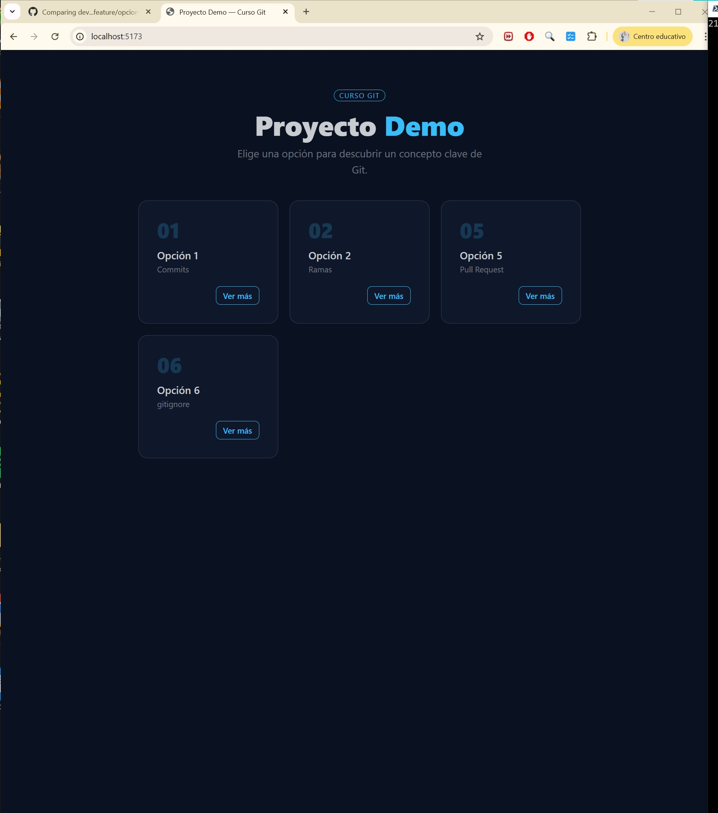
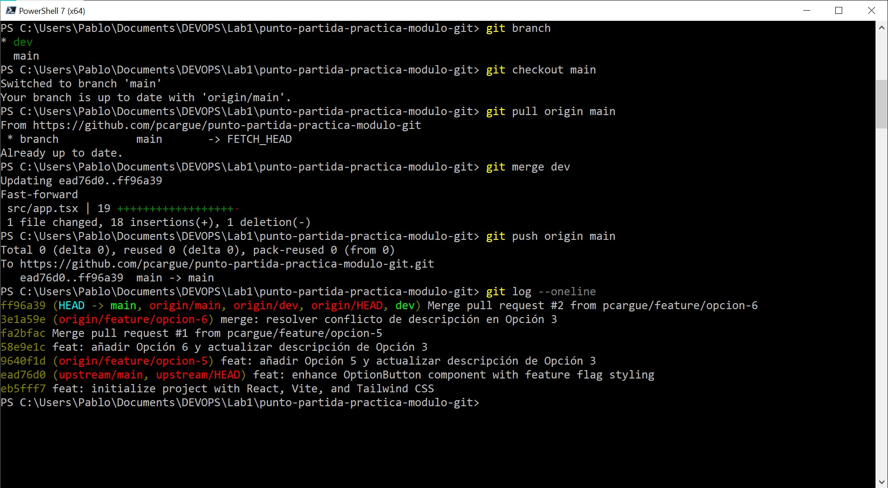

# Diario del Laboratorio — Flujo Git colaborativo

## Tarea 1 — Fork y configuración inicial

He realizado un fork del repositorio original de Lemoncode para trabajar sobre una copia propia. Esto me permite modificar el código sin afectar al repositorio original. Posteriormente, he clonado el fork en local y he añadido el repositorio original como `upstream`, lo que sirve para poder sincronizar cambios si fuera necesario.

Después, he creado la rama `dev`, que se utilizará como rama intermedia de desarrollo antes de pasar los cambios a `main`.

---

## Tarea 2 — Feature branch A: añadir la Opción 5

He creado la rama `feature/opcion-5` a partir de `dev`. Es importante trabajar en ramas independientes para no afectar directamente a la rama principal y poder organizar mejor el desarrollo.

En esta rama he añadido la Opción 5 y he modificado la descripción de la Opción 3 a "Flujo de trabajo".

---

## Tarea 3 — Feature branch B: añadir la Opción 6 (aquí está el conflicto)

Antes de mezclar la rama anterior, he creado una segunda rama llamada `feature/opcion-6`, también a partir de `dev`. Esto es importante porque ambas ramas deben partir del mismo estado inicial para que se pueda generar un conflicto posteriormente.

En esta rama he añadido la Opción 6 y he modificado la misma línea de la Opción 3, pero con un valor distinto: "Flujo profesional".

Esto provocará un conflicto porque ambas ramas modifican la misma línea de forma diferente.

---

## Tarea 4 — Pull Request 1: Feature A a dev

He creado una Pull Request desde `feature/opcion-5` hacia `dev`. Antes de hacer el merge, he revisado la pestaña *Files changed* para comprobar exactamente qué cambios se iban a integrar.

Esto es útil porque permite detectar errores antes de fusionar el código.

Después, he realizado el merge de la Pull Request.

---

## Tarea 5 — Pull Request 2: Feature B a dev, conflicto

He creado una Pull Request desde `feature/opcion-6` hacia `dev`. En este caso, GitHub ha detectado un conflicto, ya que ambas ramas modifican la misma línea de la Opción 3.

Al intentar fusionar en local, Git ha marcado el conflicto con los siguientes indicadores:

- `<<<<<<<` indica la versión de la rama actual  
- `=======` separa ambas versiones  
- `>>>>>>>` indica la versión de la otra rama  

He resuelto el conflicto eligiendo la versión "Flujo profesional", eliminando los marcadores y asegurando que se mantienen correctamente todas las opciones (5 y 6).

Después de la resolución, he comprobado que la aplicación funciona correctamente y muestra todas las opciones.

Finalmente, he confirmado los cambios y completado el merge de la Pull Request.

---

## Tarea 6 — Limpieza y cierre del diario

He eliminado las ramas de funcionalidad (`feature/opcion-5` y `feature/opcion-6`) tanto en GitHub como en local, ya que ya no son necesarias.

También he revisado el historial de commits con `git log --oneline` para comprobar que todos los cambios se han integrado correctamente.

---

## Reflexión final

La parte más compleja del laboratorio ha sido entender cómo se generan los conflictos y cómo resolverlos correctamente sin perder información. Ahora comprendo mejor la importancia de trabajar con ramas, revisar los cambios mediante Pull Requests y gestionar conflictos de forma controlada, lo cual es fundamental en entornos de desarrollo colaborativo.